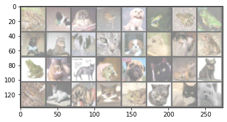
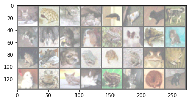

```python
import torch
import torchvision
import torchvision.transforms as transforms
import torch.nn as nn
import torch.nn.functional as F
import torch.optim as optim

import matplotlib.pyplot as plt
from sklearn.model_selection import train_test_split
import numpy as np
%matplotlib inline
import time
```


```python
with np.load('/content/drive/MyDrive/Colab Notebooks/prediction-challenge-02-data.npz') as fh:
    x_train = fh['x_train']
    y_train = fh['y_train']
    x_test = fh['x_test']

# TRAINING DATA: INPUT (x) AND OUTPUT (y)
# 1. INDEX: IMAGE SERIAL NUMBER (6000)
# 2/3. INDEX: PIXEL VALUE (32 x 32)
# 4. INDEX: COLOR CHANNELS (3)
print(x_train.shape, x_train.dtype)
print(y_train.shape, y_train.dtype)

# TEST DATA: INPUT (x) ONLY
print(x_test.shape, x_test.dtype)
```

    (3000, 32, 32, 3) float32
    (3000,) float64
    (300, 32, 32, 3) float32
    


```python
x_train = np.transpose(x_train, axes=[0, 3, 1, 2])
x_test = np.transpose(x_test, axes=[0, 3, 1, 2])
print(x_train.shape, x_train.dtype)
print(y_train.shape, y_train.dtype)
print(x_test.shape, x_test.dtype)
```

    (3000, 3, 32, 32) float32
    (3000,) float64
    (300, 3, 32, 32) float32
    


```python
tf = transforms.Compose([transforms.ToTensor(), transforms.Normalize((0.5, 0.5, 0.5), (0.5, 0.5, 0.5))])
classes = ('plane', 'car', 'bird', 'cat', 'deer', 'dog', 'frog', 'horse', 'truck', 'ship')
```


```python
LR = 0.001 
EPOCH = 30
BATCH_SIZE = 32
```


```python
X_train, X_val, y_train, y_val = train_test_split(x_train, y_train, test_size=0.1)
```


```python
# Transform np to tensor
torch_X_train = torch.tensor(X_train)
torch_y_train = torch.tensor(y_train)

torch_X_val = torch.tensor(X_val)
torch_y_val = torch.tensor(y_val)

train = torch.utils.data.TensorDataset(torch_X_train,torch_y_train)
validate = torch.utils.data.TensorDataset(torch_X_val,torch_y_val)

train_loader = torch.utils.data.DataLoader(train, batch_size = BATCH_SIZE, shuffle = True)
val_loader = torch.utils.data.DataLoader(validate, batch_size = BATCH_SIZE, shuffle = False)
```


```python
train_batch_size = 100
test_batch_size = 4

device = torch.device("cuda:0" if torch.cuda.is_available() else "cpu") 
```


```python
def imshow(img):
    img = img / 2 + 0.5     # unnormalize
    npimg = img.numpy()
    plt.imshow(np.transpose(npimg, (1, 2, 0)))
    plt.show()


# get some random training images
dataiter = iter(train_loader)
images, labels = dataiter.next()

# show images
imshow(torchvision.utils.make_grid(images))
# print labels
print(' '.join('%5s' % classes[labels[j].to(dtype=torch.long, device=device)] for j in range(32)))
```





     bird   car   car   car   car  bird  bird  bird   car plane   car plane   car plane plane  bird  bird plane plane  bird   car plane  bird plane  bird plane plane plane  bird plane plane   car
    


```python
class CNN(nn.Module):
  def __init__(self):
    super(CNN, self).__init__()
    self.conv_layer = nn.Sequential(

      # Conv Layer block 1
      nn.Conv2d(in_channels=3, out_channels=32, kernel_size=3, padding=1),
      nn.BatchNorm2d(32),
      nn.ReLU(inplace=True),
      nn.Conv2d(in_channels=32, out_channels=64, kernel_size=3, padding=1),
      nn.ReLU(inplace=True),
      nn.MaxPool2d(kernel_size=2, stride=2),

      # Conv Layer block 2
      nn.Conv2d(in_channels=64, out_channels=128, kernel_size=3, padding=1),
      nn.BatchNorm2d(128),
      nn.ReLU(inplace=True),
      nn.Conv2d(in_channels=128, out_channels=128, kernel_size=3, padding=1),
      nn.ReLU(inplace=True),
      nn.MaxPool2d(kernel_size=2, stride=2),
      nn.Dropout2d(p=0.05),

      # Conv Layer block 3
      nn.Conv2d(in_channels=128, out_channels=256, kernel_size=3, padding=1),
      nn.BatchNorm2d(256),
      nn.ReLU(inplace=True),
      nn.Conv2d(in_channels=256, out_channels=256, kernel_size=3, padding=1),
      nn.ReLU(inplace=True),
      nn.MaxPool2d(kernel_size=2, stride=2),
    )


    self.fc_layer = nn.Sequential(
      nn.Dropout(p=0.1),
      nn.Linear(4096, 1024),
      nn.ReLU(inplace=True),
      nn.Linear(1024, 512),
      nn.ReLU(inplace=True),
      nn.Dropout(p=0.1),
      nn.Linear(512, 10)
    )

  def forward(self, x):
    # conv layers
    x = self.conv_layer(x)
    
    # flatten
    x = x.view(x.size(0), -1)
    
    # fc layer
    x = self.fc_layer(x)
    return x
```


```python
cnn = CNN()
```


```python
cnn.to(device)

loss_func = torch.nn.CrossEntropyLoss() 
optimizer = optim.Adam(cnn.parameters(), lr=LR)
```


```python
cnn.train()   
state_dicts = {}

train_loss = np.zeros(EPOCH)
val_loss = np.zeros(EPOCH)

for epoch in range(EPOCH):  
  for data in train_loader:    
    X, y = data
    cnn.zero_grad()                     
    output = cnn(X.to(device))                    
    y = torch.tensor(y, dtype=torch.int64).cuda()
    loss = loss_func(output, y)        
    loss.backward()                     
    optimizer.step()                    
    train_loss[epoch] += loss
  # normalizing the loss by the total number of train batches  
  train_loss[epoch] /= len(train_loader)  

  with torch.no_grad():
    for X, y in val_loader:
      output = cnn(X.to(device))
      y = torch.tensor(y, dtype=torch.int64).cuda()
      
      loss = loss_func(output, y) 
      val_loss[epoch] += loss
    val_loss[epoch] /= len(val_loader)

  state_dicts[epoch] = cnn.state_dict()   

  print('epoch %d:\ttrain loss: %.5f\tvalidation loss: %.5f'%(epoch, train_loss[epoch], val_loss[epoch])) 
```

    /usr/local/lib/python3.7/dist-packages/ipykernel_launcher.py:13: UserWarning: To copy construct from a tensor, it is recommended to use sourceTensor.clone().detach() or sourceTensor.clone().detach().requires_grad_(True), rather than torch.tensor(sourceTensor).
      del sys.path[0]
    /usr/local/lib/python3.7/dist-packages/ipykernel_launcher.py:25: UserWarning: To copy construct from a tensor, it is recommended to use sourceTensor.clone().detach() or sourceTensor.clone().detach().requires_grad_(True), rather than torch.tensor(sourceTensor).
    

    epoch 0:	train loss: 1.11193	validation loss: 0.89427
    epoch 1:	train loss: 0.85057	validation loss: 0.80022
    epoch 2:	train loss: 0.79533	validation loss: 0.74824
    epoch 3:	train loss: 0.77807	validation loss: 0.74779
    epoch 4:	train loss: 0.73314	validation loss: 0.75517
    epoch 5:	train loss: 0.70341	validation loss: 0.74348
    epoch 6:	train loss: 0.66522	validation loss: 0.71027
    epoch 7:	train loss: 0.63123	validation loss: 0.66764
    epoch 8:	train loss: 0.58960	validation loss: 0.69164
    epoch 9:	train loss: 0.60050	validation loss: 0.72256
    epoch 10:	train loss: 0.51912	validation loss: 0.77681
    epoch 11:	train loss: 0.48815	validation loss: 0.77865
    epoch 12:	train loss: 0.46890	validation loss: 0.82598
    epoch 13:	train loss: 0.41462	validation loss: 0.76422
    epoch 14:	train loss: 0.39843	validation loss: 0.84519
    epoch 15:	train loss: 0.33344	validation loss: 0.81488
    epoch 16:	train loss: 0.28483	validation loss: 0.96957
    epoch 17:	train loss: 0.29094	validation loss: 0.90185
    epoch 18:	train loss: 0.23084	validation loss: 1.03750
    epoch 19:	train loss: 0.22168	validation loss: 0.95951
    epoch 20:	train loss: 0.19030	validation loss: 1.09441
    epoch 21:	train loss: 0.18581	validation loss: 1.32390
    epoch 22:	train loss: 0.17048	validation loss: 0.94882
    epoch 23:	train loss: 0.12655	validation loss: 1.13644
    epoch 24:	train loss: 0.10289	validation loss: 1.50791
    epoch 25:	train loss: 0.10550	validation loss: 1.32950
    epoch 26:	train loss: 0.08481	validation loss: 1.21565
    epoch 27:	train loss: 0.09766	validation loss: 1.52231
    epoch 28:	train loss: 0.09045	validation loss: 1.39336
    epoch 29:	train loss: 0.08925	validation loss: 1.36211
    


```python
dataiter = iter(val_loader)
images, labels = dataiter.next()

# print images
imshow(torchvision.utils.make_grid(images))
print('GroundTruth: ', ' '.join('%5s' % classes[labels[j].to(dtype=torch.long, device=device)] for j in range(32)))
```





    GroundTruth:  plane  bird plane  bird plane plane   car   car plane   car plane   car  bird   car  bird plane  bird plane   car  bird  bird  bird  bird  bird   car  bird plane plane  bird plane plane   car
    


```python
cnn.cpu().eval()

output_train = cnn(torch_X_train.cpu()).cpu().detach().numpy().argmax(axis=1)
output_val = cnn(torch_X_val.cpu()).cpu().detach().numpy().argmax(axis=1)

print('Training accuracy:\t%.3f'%(sum(output_train == y_train)/len(y_train)))
print('Validation accuracy:\t%.3f'%(sum(output_val == y_val)/len(y_val)))
```

    Training accuracy:	0.991
    Validation accuracy:	0.710
    


```python
prediction = cnn(torch.from_numpy(x_test)).cpu().detach().numpy().argmax(axis=1)
```


```python
print(prediction[19])
```

    0
    


```python
assert prediction.ndim == 1
assert prediction.shape[0] == 300
```


```python
np.save('prediction.npy', prediction.astype(int))
```
